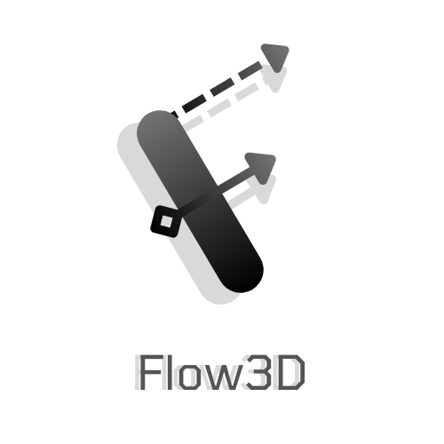

# Flow3D

<p align="center">
    
</p>

Flow3D is an interactive web-based tool for creating 3D cloud architecture diagrams. Built with React, Redux thunk, React Three Fiber, Framer Motion, and GSAP, Flow3D allows users to visualize, design, and edit cloud infrastructure in a 3D space with drag-and-drop functionalities and other editing tools.

---
## Table of contents
- [Flow3D](#flow3d)
  * [🚀 Installation](#---installation)
  * [🛠️ Usage](#----usage)
    + [Keyboard Shortcuts](#keyboard-shortcuts)
  * [✨ Features](#--features)
  * [🔧 Technologies Used](#---technologies-used)
  * [🤝 Contribution](#---contribution)
  * [📧 Contact](#---contact)

## 🚀 Installation

1. Clone the repository:
   ```bash
   git clone https://github.com/madraven05/flow-3d.git
2. Navigate to the project directory:
    ```bash
    cd flow-3d
    ```
3. Install dependencies:
    ```bash
    npm install
    ```
4. Start the development server:
    ```bash
    npm run dev
    ```

## 🛠️ Usage

- After the server starts, navigate to http://localhost:5173
- Begin by creating a new canvas
- Selecting and moving the node can be done by clicking on the node
- For moving edges, click on the edge in Select Mode

### Keyboard Shortcuts
- `s` - For Select Mode (For opening node edit menu, and editing edges)
- `m` - For Move mode (For dragging and dropping edges)
- `v` - For view mode

## ✨ Features 

- **Drag and Drop:** Easily move, place, and connect components in a 3D environment.
- **3D Visualization:** Use React Three Fiber to create immersive 3D architecture diagrams.
- **Smooth Animations:** Seamless transitions and animations powered by Framer Motion and GSAP.
- **State Management:** Efficient state management with Redux and Redux Thunk for asynchronous actions.
- **Fast Development with Vite:** Lightning-fast development experience using React Vite for quick builds and optimized performance.
- **Editing Tools:** Modify components, create connections, and adjust positions in real time.
- **Responsive Design:** Works on various screen sizes and devices.
- **Presentation Mode:** Present the canvas fullscreen with a laser pointer!

## 🔧 Technologies Used

- **React**: A JavaScript library for building user interfaces.
- **Vite**: A build tool that provides fast and optimized development for React applications.
- **Redux**: State management for predictable state updates.
- **Redux Thunk**: Middleware for handling asynchronous logic in Redux.
- **React Three Fiber**: A React renderer for Three.js, enabling 3D web applications.
- **Framer Motion**: A library for declarative animations in React.
- **GSAP**: GreenSock Animation Platform for high-performance animations.
- **Tailwind CSS**: For styling and responsive design.

## 🤝 Contribution

Contributions are welcome! If you encounter any issues or have ideas for enhancements, feel free to create a new issue or open a pull request.

## 📧 Contact

For any questions or suggestions, feel free to contact the project owner.
